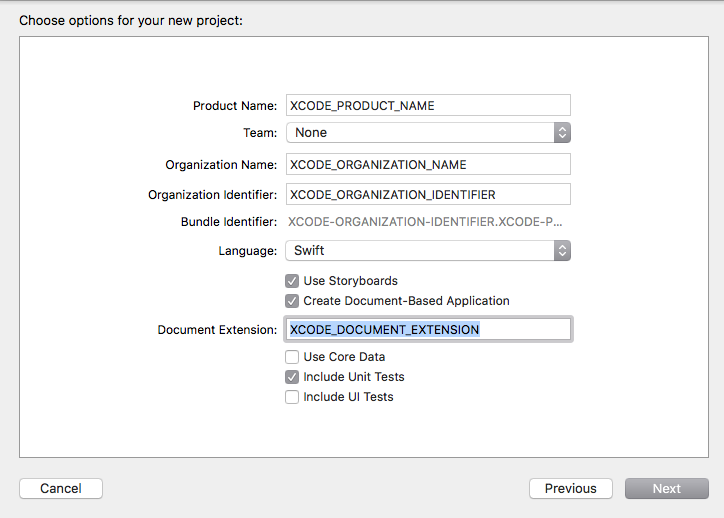

# Bartlebys macOs app xcode template

Xcode 8
Swift 3

## Project variables

| Key  | Explanation  | Mandatory |
|:------------- |:---------------:| :-------------:|
| XCODE\_PRODUCT\_NAME    | The name of the product | [X] | 
| XCODE\_ORGANIZATION\_NAME   | The organization name | [X] | 
| XCODE\_ORGANIZATION\_IDENTIFIER   | The identifier | [X] | 
| XCODE\_DOCUMENT\_EXTENSION   | The extension | [X] | 

